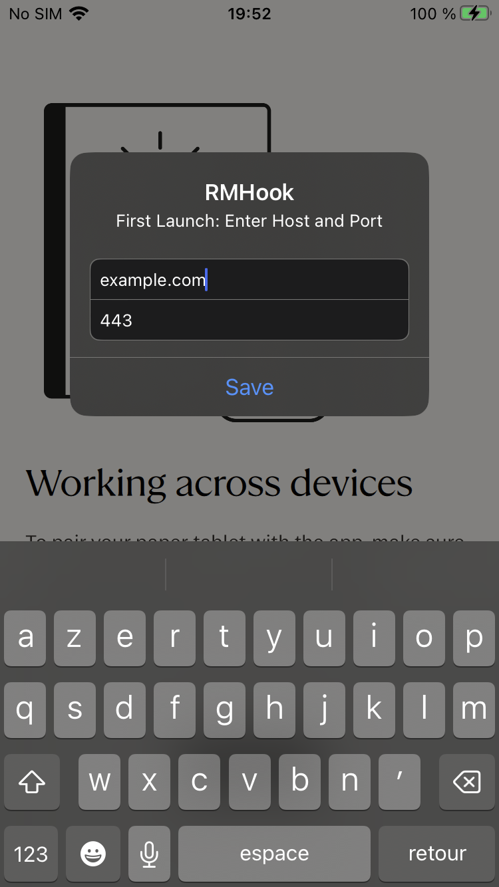

# RMHook-iOS

A dynamic library injection tweak for the reMarkable iOS app, enabling connection to self-hosted [rmfakecloud](https://github.com/ddvk/rmfakecloud) servers.

## Overview

RMHook-iOS hooks into the reMarkable iOS app's network layer to redirect API calls from reMarkable's official cloud services to your own [rmfakecloud](https://github.com/ddvk/rmfakecloud) server. This allows you to maintain full control over your documents and data on your mobile device.

Looking for the Desktop versions? Check out:
- **[RMHook](https://github.com/NohamR/RMHook)**: For macOS Desktop
- **[RMHook-Win](https://github.com/NohamR/RMHook-Win)**: For Windows Desktop

## Features

- Network request interception and redirection
- WebSocket connection patching
- In-app configuration UI to set the custom host and port
- Built specifically for iOS rootless environments

## Compatibility

**Tested and working on:**
- reMarkable iOS v3.25.0
- reMarkable iOS v3.27.1

## Installation and usage

⚠️ **For legal reasons, this repository does not include the reMarkable app.** However, a pre-built `.deb` package and a pre-patched `.ipa` are available in the [Releases](https://github.com/NohamR/RMHook-iOS/releases) section.

### Installation Options

#### Option 1: Sideloading the Patched IPA
If you do not have a jailbroken device, you can use sideloading tools like [AltStore](https://altstore.io/), [Sideloadly](https://sideloadly.io/), or TrollStore to install the pre-patched `.ipa` from the Releases page.

#### Option 2: Jailbroken Installation (.deb)
If you are on a rootless jailbreak, you can install the `.deb` package using Sileo, Zebra, or from the terminal:
```bash
dpkg -i xyz.noham.rmhook_version_iphoneos-arm64.deb
```

#### Option 3: Manual Patching 
You can patch your own reMarkable `.ipa` using [Cyan](https://github.com/asdfzxcvbn/cyan):
```bash
cyan -i reMarkable.ipa \
     -o reMarkable_patched.ipa \
     -f xyz.noham.rmhook_version_iphoneos-arm64.deb -u
```

### Setup & Configuration

Upon launching the app for the first time, you will be prompted to enter your `rmfakecloud` host and port via an in-app alert dialog.



## Building

### 1. Prerequisites (Qt for iOS)

The tweak statically links against iOS Qt libraries and uses customized C++17 flags. You will need to install the Qt headers and libraries locally using the `aqtinstall` Python tool.

Create a Python environment and install `aqtinstall`:
```bash
python3 -m venv aqt_venv
source aqt_venv/bin/activate
pip install aqtinstall
```

Then, download the required Qt versions for iOS to your home directory (e.g., `6.8.2` for the 3.25.0 target and `6.10.0` for the 3.27.1 target):
```bash
# Install Qt 6.8.2 for iOS (used for v3.25.0)
aqt install-qt mac ios 6.8.2 -m qtwebsockets --outputdir ~/Qt

# Install Qt 6.10.0 for iOS (used for v3.27.1)
aqt install-qt mac ios 6.10.0 -m qtwebsockets --outputdir ~/Qt
```

### 2. Finding Specific App Function Offsets

Because iOS apps are stripped and standard symbol hooking isn't always viable on heavily optimized C++ applications, RMHook-iOS hooks specific memory offsets within the binary.

If you're compiling for a new version of the reMarkable app, you must disassemble the app binary (e.g., using IDA Pro) to find the correct static memory addresses (offsets) for functions like `QNetworkAccessManager::createRequest` and `QWebSocket::open`.

Once found, you will add the macros to `src/Tweak.xm` using a new `#elif NEW_VERSION` block to define these offsets, allowing the dynamic hook resolver to intercept them at runtime.

### 3. Clone and Compile

```bash
git clone https://github.com/NohamR/RMHook-iOS.git
cd RMHook-iOS
```

Use `script/build.sh` to compile the tweak for a specific version. Make sure to run it from inside the `src` directory or point directly to the script.

```bash
cd src

# Build for version 3.25.0 in development mode (default)
../script/build.sh 3.25.0

# Build for version 3.27.1 in development mode
../script/build.sh 3.27.1 dev

# Build in release mode (updates the control file package version and builds final)
../script/build.sh 3.27.1 release
```

## Debugging
To debug the tweak, you can use `lldb` to attach to the `remarkable_mobile` process on your device.
You can stream the device logs using `idevicesyslog` from the `libimobiledevice` suite to see the output from your hooks and any potential errors.

```bash
idevicesyslog | grep 'remarkable_mobile' | grep 'RMHook'
```

## How it works
RMHook-iOS uses Memory Hooking (`MSHookFunction`) via Theos to patch Qt framework functions statically linked inside the iOS app:
1. **QNetworkAccessManager::createRequest** - Intercepts HTTP/HTTPS requests
2. **QWebSocket::open** - Patches WebSocket connections

When the app attempts to connect to reMarkable's servers (e.g., `internal.cloud.remarkable.com`), the hooks redirect these requests to your configured host and port, which is saved persistently on the device via `NSUserDefaults` and presented via `UIKit` alerts.

## Credits
- xovi-rmfakecloud: [asivery/xovi-rmfakecloud](https://github.com/asivery/xovi-rmfakecloud) - Original hooking information
- rm-xovi-extensions: [asivery/rm-xovi-extensions](https://github.com/asivery/rm-xovi-extensions) - Extension framework for reMarkable
- rmfakecloud: [ddvk/rmfakecloud](https://github.com/ddvk/rmfakecloud) - Self-hosted reMarkable cloud

## License

This project is licensed under the MIT License. See the [LICENSE](LICENSE) file for details.

## Disclaimer

This project is not affiliated with, endorsed by, or sponsored by reMarkable AS. Use at your own risk. This tool modifies the reMarkable iOS application and may violate the application's terms of service.
