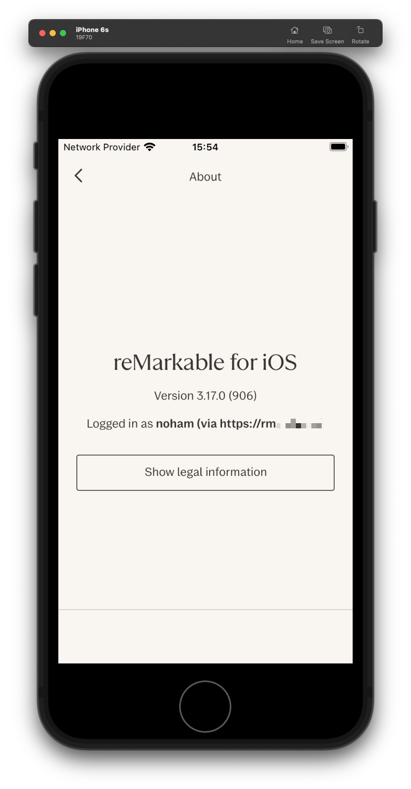
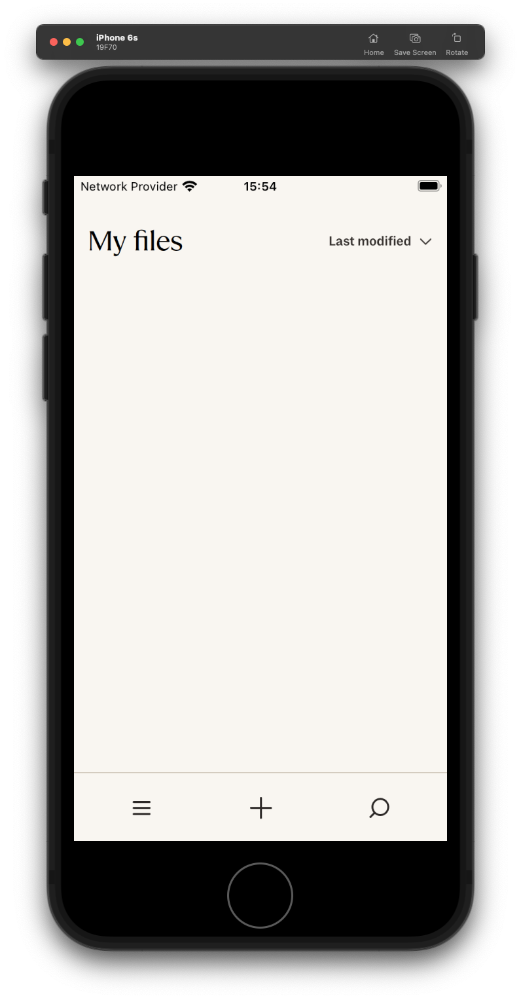

# Technical Notes: RMHook-iOS

For project overview and status, see [README.md](README.md).

## Network Stack Analysis

### URL Resolution
The app uses a custom function to select the target hostname based on environment flags:

| Condition                  | Hostname                                   |
|----------------------------|--------------------------------------------|
| Custom URL set (offset 136)| [custom].tectonic.remarkable.com           |
| QA env flag                | qa.internal.cloud.remarkable.com           |
| Dev env flag               | dev.internal.cloud.remarkable.com          |
| Stage env flag             | stage.internal.cloud.remarkable.com        |
| Default (production)       | internal.cloud.remarkable.com              |

### network::HttpManager::setupTransaction
Confirmed via RTTI: `network::HttpManager` (vtable entry 14). Source: `xochitl/src/xofm/libs/network/src/http-manager.cpp`.

#### Flow
- Resolves hostname via custom resolver or appends `.tectonic.remarkable.com` to a base URL
- Constructs a `network::detail::HttpTransaction` object
- Sets up a `network::ReplyReader` for response handling
- Dispatches via a virtual call on a queue/scheduler object
- Logs through `rm.network.http.manager` using obfuscated string literals

### Networking Library Used
This is a fully custom C++ HTTP client (`xofm/libs/network`), not NSURLSession, CFHTTPMessage, or Qt's QNetworkAccessManager.

| Layer         | Technology                                                                 |
|-------------- |----------------------------------------------------------------------------|
| TLS/HTTPS     | Apple SecureTransport (SSLCreateContext, SSLHandshake, etc.)               |
| TCP transport | POSIX BSD sockets (_socket, _connect, _recv/_read, _write/_sendmsg)        |
| DNS           | _getaddrinfo / _freeaddrinfo                                               |
| Event loop    | CFSocket + CFRunLoop integration                                           |
| Async exec    | GCD (dispatch_queue_create, dispatch_async)                                |
| Cert pinning  | SecTrustEvaluate, SecTrustSetAnchorCertificates, SecPKCS12Import           |
| TLS ALPN      | SSLSetALPNProtocols / SSLCopyALPNProtocols (HTTP/2 or gRPC support)        |

The app is Qt-based (QIOS* classes), but the networking layer bypasses Qt entirely. It talks directly to either `*.internal.cloud.remarkable.com` (REST API) or a tectonic-suffixed host with raw TLS sockets.

## Hook Candidate Analysis
| Hook candidate | Pros                                                  | Cons                                                                                           |
| -------------- | ----------------------------------------------------- | ---------------------------------------------------------------------------------------------- |
| sub_1000C81B8  | Single purpose, small, all env variants go through it | Need to handle X8 output ABI                                                                   |
| sub_1000AA31C  | (setupTransaction)	High level                         | Complex function, 0x738 bytes, hard to isolate the host field                                  |
| sub_10180B1BC  | (string ctor)	Leaf function                           | Called from many places, need to filter callers                                                |
| sub_1000AB478  | (URL builder for tectonic)                            | Catches tectonic-path specifically	Only covers one of the two code paths (the custom-URL path) |

```cpp
void __usercall sub_1000C81B8(__int64 a1@<X0>, _QWORD *a2@<X8>)
{
  unsigned int *v4; // x19
  __int64 v5; // x21
  __int64 v6; // x22
  unsigned int v7; // w8
  unsigned int v8; // w8
  unsigned int v9; // w8
  unsigned int *v10; // x8
  unsigned int v11; // w9
  unsigned int v12; // w9
  void *v13[2]; // [xsp+8h] [xbp-58h] BYREF
  __int64 v14; // [xsp+18h] [xbp-48h]
  __int128 v15; // [xsp+20h] [xbp-40h] BYREF
  __int64 v16; // [xsp+30h] [xbp-30h]

  if ( *(_BYTE *)(a1 + 136) )
  {
    (*(void (__fastcall **)(void **__return_ptr))(**(_QWORD **)(a1 + 128) + 112LL))(v13);
  }
  else
  {
    v13[0] = 0;
    v13[1] = 0;
    v14 = 0;
  }
  v4 = *(unsigned int **)(a1 + 240);
  v5 = *(_QWORD *)(a1 + 248);
  v6 = *(_QWORD *)(a1 + 256);
  if ( v4 )
  {
    do
      v7 = __ldaxr(v4);
    while ( __stlxr(v7 + 1, v4) );
  }
  if ( v14 )
  {
    *(_QWORD *)&v15 = v13;
    *((_QWORD *)&v15 + 1) = ".tectonic.remarkable.com";
    sub_1000AB478(a2, &v15);
    if ( !v4 )
      goto LABEL_25;
    goto LABEL_22;
  }
  if ( v6 == qword_1028F6140 && (unsigned int)sub_10180246C(v6, v5, v6, *((_QWORD *)&xmmword_1028F6130 + 1)) )
    goto LABEL_20;
  if ( v6 == qword_1028F6158 && (unsigned int)sub_10180246C(v6, v5, v6, qword_1028F6150) )
  {
    sub_10180B1BC(&v15, 35, "stage.internal.cloud.remarkable.com");
    goto LABEL_21;
  }
  if ( v6 == qword_1028F6188 && (unsigned int)sub_10180246C(v6, v5, v6, qword_1028F6180) )
  {
    sub_10180B1BC(&v15, 33, "dev.internal.cloud.remarkable.com");
    goto LABEL_21;
  }
  if ( v6 != qword_1028F6170 || !(unsigned int)sub_10180246C(v6, v5, v6, qword_1028F6168) )
LABEL_20:
    sub_10180B1BC(&v15, 29, "internal.cloud.remarkable.com");
  else
    sub_10180B1BC(&v15, 32, "qa.internal.cloud.remarkable.com");
LABEL_21:
  *(_OWORD *)a2 = v15;
  a2[2] = v16;
  if ( !v4 )
    goto LABEL_25;
  do
  {
LABEL_22:
    v8 = __ldaxr(v4);
    v9 = v8 - 1;
  }
  while ( __stlxr(v9, v4) );
  if ( !v9 )
    j__free(v4);
LABEL_25:
  v10 = (unsigned int *)v13[0];
  if ( v13[0] )
  {
    do
    {
      v11 = __ldaxr(v10);
      v12 = v11 - 1;
    }
    while ( __stlxr(v12, v10) );
    if ( !v12 )
      j__free(v13[0]);
  }
}
```

```cpp
void __usercall sub_1000C8444(_QWORD *a1@<X0>, __int64 a2@<X8>)
{
  unsigned int *v3; // x19
  __int64 v4; // x21
  __int64 v5; // x22
  unsigned int v6; // w8
  unsigned int v7; // w8
  unsigned int v8; // w8
  __int128 v9; // [xsp+0h] [xbp-40h] BYREF
  __int64 v10; // [xsp+10h] [xbp-30h]

  v3 = (unsigned int *)a1[30];
  v4 = a1[31];
  v5 = a1[32];
  if ( v3 )
  {
    do
      v6 = __ldaxr(v3);
    while ( __stlxr(v6 + 1, v3) );
  }
  if ( v5 == qword_1028F6140 && (unsigned int)sub_10180246C(v5, v4, v5, *((_QWORD *)&xmmword_1028F6130 + 1)) )
    goto LABEL_14;
  if ( v5 == qword_1028F6158 && (unsigned int)sub_10180246C(v5, v4, v5, qword_1028F6150) )
  {
    sub_10180B1BC(25, (__int64)"staging.my.remarkable.com", &v9);
    goto LABEL_15;
  }
  if ( v5 == qword_1028F6188 && (unsigned int)sub_10180246C(v5, v4, v5, qword_1028F6180) )
  {
    sub_10180B1BC(29, (__int64)"development.my.remarkable.com", &v9);
    goto LABEL_15;
  }
  if ( v5 != qword_1028F6170 || !(unsigned int)sub_10180246C(v5, v4, v5, qword_1028F6168) )
LABEL_14:
    sub_10180B1BC(17, (__int64)"my.remarkable.com", &v9);
  else
    sub_10180B1BC(20, (__int64)"qa.my.remarkable.com", &v9);
LABEL_15:
  *(_OWORD *)a2 = v9;
  *(_QWORD *)(a2 + 16) = v10;
  if ( v3 )
  {
    do
    {
      v7 = __ldaxr(v3);
      v8 = v7 - 1;
    }
    while ( __stlxr(v8, v3) );
    if ( !v8 )
      j__free(v3);
  }
}
```

## Current Status

```log
2026-02-22 15:53:36.296954+0100 0x736818   Default     0x0                  46841  0    remarkable_mobile: (RMHook.dylib) [RMHook] 'remarkable_mobile' base = 0x102c28000
2026-02-22 15:53:36.298221+0100 0x736818   Default     0x0                  46841  0    remarkable_mobile: (RMHook.dylib) [RMHook] Hooked sub_1000C81B8 @ 0x102cf01b8 (offset 0xc81b8)
2026-02-22 15:53:36.298343+0100 0x736818   Default     0x0                  46841  0    remarkable_mobile: (RMHook.dylib) [RMHook] Hooked sub_1000C8444 @ 0x102cf0444 (offset 0xc8444)
2026-02-22 15:53:36.416893+0100 0x736818   Default     0x0                  46841  0    remarkable_mobile: (RMHook.dylib) [RMHook] >>> sub_1000C8444 ENTER  a1=0x12070d5e0  x8(out)=0x16d1d2bf0
2026-02-22 15:53:36.416985+0100 0x736818   Default     0x0                  46841  0    remarkable_mobile: (RMHook.dylib) [RMHook] <<< sub_1000C8444 RETURN original (17 chars) = "my.remarkable.com"
2026-02-22 15:53:36.417039+0100 0x736818   Default     0x0                  46841  0    remarkable_mobile: (RMHook.dylib) [RMHook] <<< sub_1000C8444 patched → "rm.noh.am"
2026-02-22 15:53:36.466471+0100 0x736818   Default     0x0                  46841  0    remarkable_mobile: (RMHook.dylib) [RMHook] >>> sub_1000C8444 ENTER  a1=0x12070d5e0  x8(out)=0x16d1d34b0
2026-02-22 15:53:36.466558+0100 0x736818   Default     0x0                  46841  0    remarkable_mobile: (RMHook.dylib) [RMHook] <<< sub_1000C8444 RETURN original (17 chars) = "my.remarkable.com"
2026-02-22 15:53:36.466604+0100 0x736818   Default     0x0                  46841  0    remarkable_mobile: (RMHook.dylib) [RMHook] <<< sub_1000C8444 patched → "rm.noh.am"
2026-02-22 15:53:47.331051+0100 0x736818   Default     0x0                  46841  0    remarkable_mobile: (RMHook.dylib) [RMHook] >>> sub_1000C81B8 ENTER  a1=0x12070d5e0  x8(out)=0x16d1497e0
2026-02-22 15:53:47.331226+0100 0x736818   Default     0x0                  46841  0    remarkable_mobile: (RMHook.dylib) [RMHook] <<< sub_1000C81B8 RETURN original (29 chars) = "internal.cloud.remarkable.com"
2026-02-22 15:53:47.331350+0100 0x736818   Default     0x0                  46841  0    remarkable_mobile: (RMHook.dylib) [RMHook] <<< patched → "rm.noh.am"
```

The above log shows that both hooks are successfully intercepting the hostname resolution and replacing it with "rm.noh.am". However, the app still fails to fetch documents..

